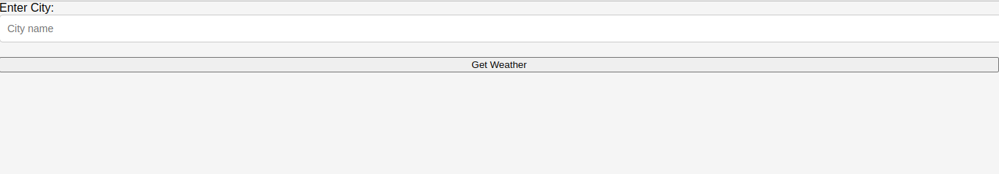
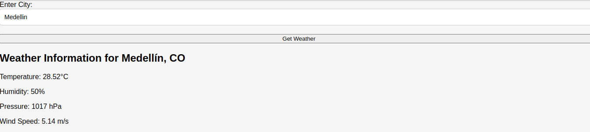

# Weather APP - monolìtica

Esta es una aplicación web básica que permite a los usuarios consultar la información del clima de una ciudad. La aplicación se implementa como una aplicación monolítica utilizando tecnologías como Node.js, Express, HTML, CSS y JavaScript. A continuación, se proporciona una descripción detallada del proyecto.

## Estructura del Proyecto

El proyecto está organizado de la siguiente manera:

- **weather-app**
    - *index.html*
    - *styles.css*
    - *index.js*
    - *app.js*
    
 Contiene archivos estáticos (HTML, CSS, JS) para el frontend.
- **app.js**: Archivo principal del servidor monolítico.


## Configuración e Instalación

1. **Instalación de Dependencias:**

   ```bash
   npm install
   ```

2. **Ejecución de la Aplicación:**

   ```bash
   npm start
   ```

   La aplicación se ejecutará en [http://localhost:3000](http://localhost:3000).
   

   ## Funcionalidades

- **Formulario de Consulta de Clima:**

    


  - Endpoint `/weather` que muestra un formulario para que el usuario ingrese el nombre de una ciudad.
  - Al enviar el formulario, la aplicación llama al endpoint anterior para obtener la información del clima y la muestra en la página web.

- **Consulta de Clima por Ciudad:**

    


  - Endpoint `/api/weather/:city` que devuelve información del clima de la ciudad especificada en la ruta, incluyendo temperatura actual, humedad, presión atmosférica y velocidad del viento.


   